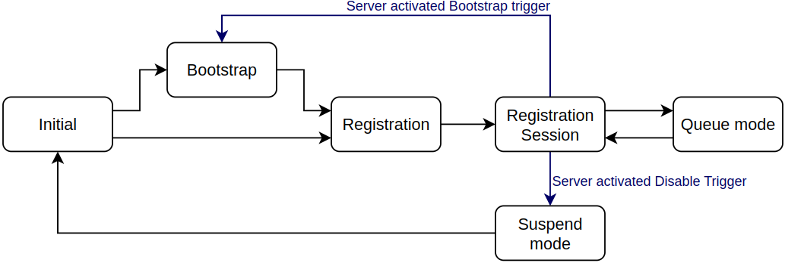
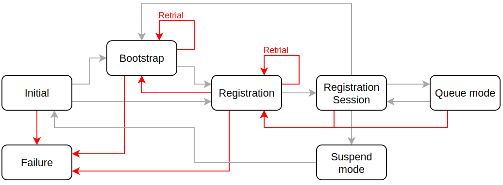
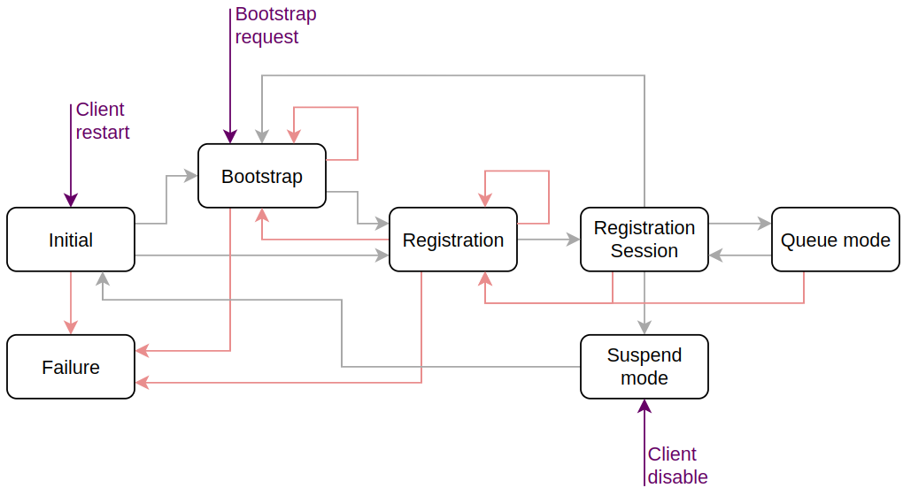

..
   Copyright 2023-2026 AVSystem <avsystem@avsystem.com>
   AVSystem Anjay Lite LwM2M SDK
   All rights reserved.

   Licensed under AVSystem Anjay Lite LwM2M Client SDK - Non-Commercial License.
   See the attached LICENSE file for details.

LwM2M Client Logic
==================

Overview
--------

This document describes the LwM2M client state machine in Anjay Lite.
It outlines state transitions, error handling, and user-triggered actions
throughout the client lifecycle.
The design supports bootstrap, registration sessions, and manual control via
the ``anj_core`` API.

State machine overview
----------------------

The client state machine includes several operational states, each responsible
for specific tasks and transitions.
Some internal or intermediate states (such as ``ANJ_CONN_STATUS_INVALID``) are
not covered here.
For a full list, refer to the ``anj_conn_status_t`` definition in the source
code.

The following diagram illustrates the state transitions, without error handling:



Initial
^^^^^^^

* The client always starts in the **Initial** state.
* Validates the presence of LwM2M Security and Server Object instances.
* If the Security Object contains only a Bootstrap Server instance
  (``0/x/1`` = True), it transitions to **Bootstrap**.
* If a regular LwM2M Server instance is found in both Security and Server
  Objects, it transitions to **Registration**.

Bootstrap
^^^^^^^^^

* Reads and validates the Bootstrap Server Security instance.
* Opens a connection to the LwM2M Bootstrap Server.
* Sends a ``Bootstrap-Request`` message.
* Awaits configuration requests from LwM2M Bootstrap Server.
* After receiving ``Bootstrap-Finish`` message, closes the connection and
  transitions to the **Registration** state.

Registration
^^^^^^^^^^^^

* Reads and validates corresponding Server and Security Object instances.
* Opens a connection to the LwM2M Server.
* Sends a ``Register`` request.
* After receiving a valid response, transitions to **Registration Session**.
* When a new registration session starts, clears all existing observations and
  pending send requests.

Registration Session
^^^^^^^^^^^^^^^^^^^^

* Handles incoming server requests.
* Schedules ``Update`` messages according to the following formula:
    ``MAX(lifetime/2,lifetime - MAX_TRANSMIT_WAIT)``

  where:

  * ``MAX_TRANSMIT_WAIT`` is a CoAP-defined transmission parameter that
    represents the maximum expected time to complete a confirmable message
    exchange. Check the CoAP specification for more details.
  * If ``lifetime`` (``/1/x/1``) equals `0`, timeout is infinite and no
    ``Update`` is sent.
  * If lifetime changes, recalculates the timeout  and sends an immediate
    ``Update``.
  * If list of objects or object instances changes, sends an immediate
    ``Update``.

* Handles ``Notification`` and ``LwM2M Send`` messages.
* If queue mode is enabled, transitions to **Queue Mode** state after the
  timeout expires. Stage transition is followed by connection closure.
* The LwM2M Server may enforce transitions:

  * to **Suspend Mode** via resource ``/1/x/4``
  * to **Bootstrap** via resource ``/1/x/9``

    In both cases, the client first sends ``Deregister`` and closes
    the connection.


.. note::
   LwM2M allows only one message exchange at a time.
   Large payloads may block other messages.
   To avoid blocking during FOTA, use **Pull** mode instead of **Push**,
   as Pull mode uses a separate connection, avoiding interference with other
   operations such as ```Update``` messages or notifications.

Queue Mode
^^^^^^^^^^

* Ignores inbound requests but continues evaluating whether to send ``Update``,
  ``Send``, or ``Notification`` messages.
* When outbound communication is needed, re-establishes the connection and
  transitions back to **Registration session**.

See :doc:`AT-QueueMode` for more details.

Suspend Mode
^^^^^^^^^^^^

* No operations are performed during suspend mode.
* After the Disable Timeout period (resource ``/1/x/5``) expires, automatically
  transitions to **Initial**.
* Anjay Lite doesn't yet support buffering notifications while suspended.

.. note::
   Suspend mode is typically less efficient than queue mode, as it requires
   re-registration afterward.

Error handling logic
--------------------

The following diagram shows how Anjay Lite handles errors:



Errors are grouped by state, each with its own handling logic.

.. list-table:: Error Handling Logic Table
   :header-rows: 1
   :widths: 10 60 60

   * - **State / Phase**
     - **Error Types / Additional Information**
     - **Handling Logic**

   * - **Initial**
     - Missing or invalid Security and Server Object instances
     - Transition to **Failure**

   * - **Bootstrap**
     - - Network layer errors (e.g., connection issues)
       - Configuration validation failure
       - Bootstrap timeout
       - **Individual request failures (e.g., unsupported Bootstrap Discover
         operation) do not affect overall outcomes**
     - - Retries follow ``anj_configuration_t.bootstrap_retry_timeout`` and
         ``anj_configuration_t.bootstrap_retry_count``
       - On exceeding retry limits, transitions to **Failure**

   * - **Registration**
     - - Network issues
       - Invalid or missing response for ``Register`` message
       - Internal issues (e.g., excessively long location paths)
     - - Errors initiate retries as per resources:
         Communication Retry Count (``/1/x/17``),
         Communication Retry Timer (``/1/x/18``),
         Communication Sequence Delay Timer (``/1/x/19``), and
         Communication Sequence Retry Count (``/1/x/20``)
       - On failure: transition to **Failure** or **Bootstrap**, depending on
         ``Bootstrap on Registration Failure`` resource (``/1/x/16``)

   * - **Registration Session**
     - - Network errors
       - Invalid or missing response for ``Update`` message
       - Internal issues
       - **Invalid server requests (client responds with an error but remains
         in the same state)**
       - **Queue Mode follows the same logic**
     - Connection closes and re-registration is attempted

   * - **Suspend Mode**
     - Only closes connection
     - **Connection closure failure doesn't change state**

   * - **Failure**
     - Triggered from Initial, Bootstrap or Registration states after retries
       exhaustion
     - Client remains in **Failure** state until user initiates recovery via
       ``anj_core`` API.

User-controlled client management
---------------------------------

The ``anj_core`` API lets you manage the client lifecycle and force state
transitions.
The client cannot exit the **Failure** state without explicit user intervention.
The following diagram illustrates the user-controlled client management logic:



.. list-table::
   :header-rows: 1
   :widths: 25 75

   * - **API function**
     - **Description**
   * - ``anj_core_restart()``
     - Forces transition to **Initial**.
   * - ``anj_core_request_bootstrap()``
     - Transitions to **Bootstrap** unless already bootstrapping.
       This is the only restriction for forced transitions.
   * - ``anj_core_disable_server()``
     - Transitions to **Suspend Mode**:

       * Server- and user-triggered suspensions use separate timeouts.
         The client exits Suspend Mode only after both timeouts expire.
       * Calling ``anj_core_disable_server()`` while already in Suspend Mode
         updates the timeout.
       * Passing ``ANJ_TIME_DURATION_INVALID`` suspends indefinitely.

.. note::

   Transitions triggered by the ``anj_core`` API start with a ``Deregister``
   message (if the client is registered), followed by closing the connection.

Additional notes
----------------

* Network configurations are set via ``anj_configuration_t.net_socket_cfg``.
* State transitions involving connection closures typically reset the network
  context, except transitions from **Registration Session** into either
  **Queue Mode** or **Suspend Mode**.
* All requests follow the CoAP specification and support Block-Wise Transfers.
  Default transaction parameters can be modified via
  ``anj_configuration_t.udp_tx_params`` and
  ``anj_configuration_t.exchange_request_timeout_ms``.
* The client supports exactly one LwM2M Bootstrap Server and one regular
  LwM2M Server instance.
* The ``anj_core_ongoing_operation()`` function ensures safe access to objects
  that might currently be involved in active client operations.
  Always check its return value to avoid conflicts during concurrent
  modifications.
