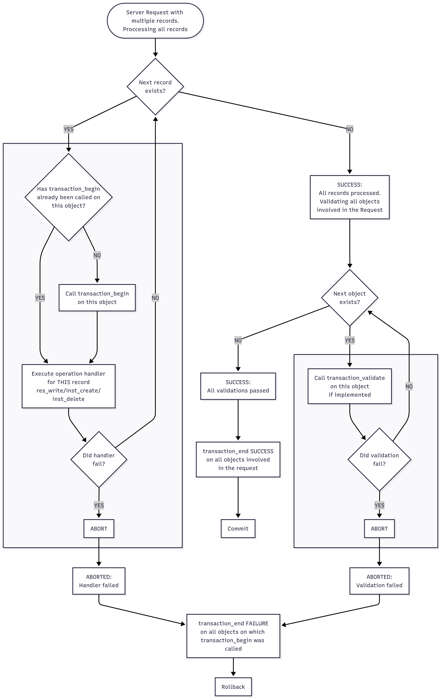

..
   Copyright 2023-2026 AVSystem <avsystem@avsystem.com>
   AVSystem Anjay Lite LwM2M SDK
   All rights reserved.

   Licensed under AVSystem Anjay Lite LwM2M Client SDK - Non-Commercial License.
   See the attached LICENSE file for details.

Understanding Transactions
==========================

Overview
--------

Transactions ensure **data integrity** and **atomicity** for LwM2M operations
(Create, Write, Delete) in Anjay Lite. They guarantee that operations either
complete fully or roll back entirely, preventing inconsistent device states
like mismatched credentials, incomplete configurations.

.. note::

    Examples reference the Security Object (Object ID: 0) from
    ``src/anj/dm/dm_security_object.c``, the Binary App Data Container
    (Object ID: 19) from ``examples/tutorial/AT-MultiInstanceResource``,
    and the Temperature Object from
    ``examples/tutorial/AT-MultiInstanceObjectDynamic``. Some implementation
    details are simplified for clarity.

Example Use Cases
-----------------

These examples illustrate why transactional operations matter: groups of
related changes must be applied atomically to keep device state consistent.

**Multiple resources updated atomically**
    APN Connection Profile Object (ID: 11): ``User Name`` and ``Secret`` must be
    updated together. If the ``User Name`` contains invalid characters,
    the ``Secret`` must not be updated either.

**Multiple object instances updated atomically**
    Security Object (ID: 0): can have multiple instances, but only one
    can have ``Bootstrap Server`` Resource set to ``true``. When trying to
    create a new instance with ``Bootstrap Server`` set to ``true`` while
    another instance already has it set, the operation must fail and no
    instance should be created.

**Multiple objects updated atomically**
    Server Object (ID: 1) and APN Connection Profile Object (ID: 11): When
    updating ``APN Link`` Resource in the Server Object to point to a new
    APN profile, the corresponding APN Connection Profile must also be
    created or updated. If either update fails, both changes must be
    rolled back to maintain consistency.

Transaction Handlers
--------------------

To handle transactions you must implement two handlers called at the
beginning and end of the transaction. Optionally, you can also implement
a validation handler:

.. code-block:: c

    // Required handlers
    static int transaction_begin(anj_t *anj, const anj_dm_obj_t *obj);
    static void transaction_end(anj_t *anj, const anj_dm_obj_t *obj,
                                anj_dm_transaction_result_t result);

    // Optional validation handler
    static int transaction_validate(anj_t *anj, const anj_dm_obj_t *obj);

``transaction_begin()``
    Called when the LwM2M server sends a request
    involving this Object that may alter its state - specifically for
    Create, Write, or Delete operations. You are expected to back up
    the current state of the object so that it can be restored in
    ``transaction_end`` if the operation fails.

``transaction_validate()``
    This function is called after all writes/creates/deletes. You
    must validate the complete final state of the object. It is called
    only once per object, even if there are multiple object instances or
    resource instances being modified.

    .. note::
        Implementing the ``transaction_validate`` handler is optional.
        Anjay Lite will still call ``transaction_end`` even if
        ``transaction_validate`` is not implemented, allowing you to
        restore the object state in case of an error in previous steps.

    .. warning::
        Validation callbacks on multiple objects during a Write-Composite
        operation are independent and can be called in any order or not at
        all depending on results of previous operations. See the flow chart
        below for details.

``transaction_end()``
    Called after handling all Create, Write, or Delete requests and
    validation. If ``result`` is ``ANJ_DM_TRANSACTION_FAILURE``, you must
    restore the object to its previous state. This should not fail except
    in critical situations (e.g., hardware failure).

.. important::
    Sometimes, the state that needs to be saved and restored is external
    to the object itself. For example, you might be storing some data
    like security credentials in external memory or in persistent storage.

    In such cases, you have two options when modifying the object:

    1. Store the new value in a temporary location during ``res_write()``
       and commit it to persistent storage/external memory
       in ``transaction_end()`` when the transaction succeeds.
    2. Backup the old value in ``transaction_begin()`` and restore it in
       ``transaction_end()`` if the transaction fails.

    Ensure you handle such external state appropriately within your
    transaction handlers.

Atomicity Across Multiple Objects
^^^^^^^^^^^^^^^^^^^^^^^^^^^^^^^^^^
Write-Composite and Bootstrap Pack Request(not supported yet) operations can modify multiple
objects atomically. Anjay Lite guarantees:

- ``transaction_begin()`` called on an affected object before
  operations on **this** object happen
- ``transaction_validate()`` called on **all** affected objects if:

  - handler is implemented
  - **all** previous operations finished successfully
  - **all** prior ``transaction_validate()`` calls finished successfully
- ``transaction_end(result)`` called on **all** affected objects after
  **all** operations and validations are complete

This ensures system-wide consistency. Each object should validate
independently without assuming other objects' states.

Flow Diagram
^^^^^^^^^^^^

..
    flowchart TD
        Start([Server Request with multiple records. Proccessing all records])
        Start --> MoreRecords

        MoreRecords{Next record exists?}
        MoreRecords -->|YES| CheckBegin
        MoreRecords -->|NO| Success1[SUCCESS: All records processed. Validating all objects involved in the Request]

        subgraph ForEachRecord [" "]
            direction TB
            CheckBegin{Has transaction_begin already been called on this object?}
            CallBegin[Call transaction_begin on this object]
            ExecHandler[Execute operation handler for THIS record res_write/inst_create/inst_delete]
            CheckFail{Did handler fail?}
            AbortOp[ABORT]

            CheckBegin -->|NO| CallBegin
            CheckBegin -->|YES| ExecHandler
            CallBegin --> ExecHandler
            ExecHandler --> CheckFail
            CheckFail -->|YES| AbortOp
        end

        CheckFail -->|NO| MoreRecords
        AbortOp --> Abort1[ABORTED: Handler failed]

        Success1 --> MoreObjects

        MoreObjects{Next object exists?}

        MoreObjects -->|YES| ValidateObj
        MoreObjects -->|NO| Success2[SUCCESS: All validations passed]

        subgraph ForEachValidate [" "]
            direction TB
            ValidateObj[Call transaction_validate on this object if implemented]
            CheckValidFail{Did validation fail?}
            AbortVal[ABORT]

            CheckValidFail -->|YES| AbortVal
            ValidateObj --> CheckValidFail

        end

        CheckValidFail -->|NO| MoreObjects
        AbortVal --> Abort2[ABORTED: Validation failed]

        Abort1 --> EndFail
        Abort2 --> EndFail
        Success2 --> EndSuccess

        EndFail[transaction_end FAILURE on all objects on which  transaction_begin was called]
        EndSuccess[transaction_end SUCCESS on all objects involved in the request]

        EndFail --> Rollback[Rollback]
        EndSuccess --> Commit[Commit]

Implementation Examples
-----------------------

Security Object (Dynamic Instances)
^^^^^^^^^^^^^^^^^^^^^^^^^^^^^^^^^^^^

The Security Object supports dynamic instance creation/deletion, so we
need to cache not only the instance data but also the structure defining
the instances. In this example in ``transaction_validate()``, we ensure that we
validate all security instances by checking uri scheme, security mode and
ensuring that SSID is set for each non-bootstrap instance.

.. code-block:: c
    :emphasize-lines: 6-7, 14-16, 41-46, 56-58

    typedef struct {
        anj_dm_obj_t obj;
        anj_dm_obj_inst_t inst[MAX_INSTANCES];
        anj_dm_security_instance_t security_instances[MAX_INSTANCES];
        // Caches for rollback
        anj_dm_obj_inst_t cache_inst[MAX_INSTANCES];
        anj_dm_security_instance_t cache_security_instances[MAX_INSTANCES];
    } anj_dm_security_obj_t;

    static int transaction_begin(anj_t *anj, const anj_dm_obj_t *obj) {
        (void) anj;
        anj_dm_security_obj_t *ctx = ANJ_CONTAINER_OF(obj, anj_dm_security_obj_t, obj);
        // Cache both structure and data
        memcpy(ctx->cache_inst, ctx->inst, sizeof(ctx->inst));
        memcpy(ctx->cache_security_instances, ctx->security_instances,
               sizeof(ctx->security_instances));
        return 0;
    }

    static int validate_instance(anj_dm_security_instance_t *inst) {
        if (!inst) {
            return -1;
        }
        if (!valid_uri_scheme(inst->server_uri)) {
            return -1;
        }
        if (!valid_security_mode((int64_t) inst->security_mode)) {
            return -1;
        }
        if (inst->ssid == ANJ_ID_INVALID
                || (inst->ssid == _ANJ_SSID_BOOTSTRAP && !inst->bootstrap_server)) {
            return -1;
        }
        return 0;
    }

    static int transaction_validate(anj_t *anj, const anj_dm_obj_t *obj) {
        (void) anj;
        anj_dm_security_obj_t *ctx = ANJ_CONTAINER_OF(obj, anj_dm_security_obj_t, obj);
        for (uint16_t idx = 0; idx < ANJ_DM_SECURITY_OBJ_INSTANCES; idx++) {
            anj_dm_security_instance_t *sec_inst = &ctx->security_instances[idx];
            if (sec_inst->iid != ANJ_ID_INVALID) {
                if (validate_instance(sec_inst)) {
                    return ANJ_DM_ERR_BAD_REQUEST;
                }
            }
        }
        return 0;
    }

    static void transaction_end(anj_t *anj, const anj_dm_obj_t *obj,
                                anj_dm_transaction_result_t result) {
        (void) anj;
        if (result == ANJ_DM_TRANSACTION_FAILURE) {
            anj_dm_security_obj_t *ctx = ANJ_CONTAINER_OF(obj, anj_dm_security_obj_t, obj);
            memcpy(ctx->inst, ctx->cache_inst, sizeof(ctx->inst));
            memcpy(ctx->security_instances, ctx->cache_security_instances,
                   sizeof(ctx->security_instances));
        }
    }

Temperature Object (Static Instances)
^^^^^^^^^^^^^^^^^^^^^^^^^^^^^^^^^^^^^

For objects with fixed instances (no Create/Delete support) we only need
to cache the instance data. The ``anj_dm_obj_inst_t`` array defines the
instances (IIDs, resource definitions). Without Create/Delete support,
this never changes during a transaction, so caching is not necessary.

.. code-block:: c
    :emphasize-lines: 3, 17-18, 37-39

    typedef struct {
        char application_type[MAX_SIZE];
        char application_type_cached[MAX_SIZE];
    } temp_obj_inst_t;

    typedef struct {
        anj_dm_obj_t obj;
        anj_dm_obj_inst_t insts[2];
        temp_obj_inst_t temp_insts[2];
    } temp_obj_ctx_t;

    static int transaction_begin(anj_t *anj, const anj_dm_obj_t *obj) {
        (void) anj;
        (void) obj;
        temp_obj_ctx_t *ctx = get_ctx();
        for (int i = 0; i < 2; i++) {
            memcpy(ctx->temp_insts[i].application_type_cached,
                   ctx->temp_insts[i].application_type, MAX_SIZE);
        }
        return 0;
    }

    static int transaction_validate(anj_t *anj, const anj_dm_obj_t *obj) {
        (void) anj;
        (void) obj;
        // Perform validation of the object state if needed
        return 0;
    }

    static void transaction_end(anj_t *anj, const anj_dm_obj_t *obj,
                                anj_dm_transaction_result_t result) {
        (void) anj;
        (void) obj;
        if (result == ANJ_DM_TRANSACTION_FAILURE) {
            temp_obj_ctx_t *ctx = get_ctx();
            for (int i = 0; i < 2; i++) {
                memcpy(ctx->temp_insts[i].application_type,
                       ctx->temp_insts[i].application_type_cached,
                       MAX_SIZE);
            }
        }
    }

Binary App Data Container (Multiple Resource Instances)
^^^^^^^^^^^^^^^^^^^^^^^^^^^^^^^^^^^^^^^^^^^^^^^^^^^^^^^^

For resources with multiple instances (``ANJ_DM_RES_RWM``), we need to
cache the data of every instrance. In this example the RIID array remains static (no
Create/Delete support) so we do not need to cache it.

.. code-block:: c
    :emphasize-lines: 8, 21, 30-32, 42

    typedef struct {
        uint8_t data[MAX_SIZE];
        size_t data_size;
    } data_inst_t;

    static const anj_riid_t res_insts[] = { 0, 1, 2 };  // Resource instance IDs
    static data_inst_t bin_data_insts[3];
    static data_inst_t bin_data_insts_cached[3];

    static const anj_dm_res_t RES_DATA = {
        .rid = 0,
        .type = ANJ_DATA_TYPE_BYTES,
        .kind = ANJ_DM_RES_RWM,
        .insts = res_insts,         // Array of RIIDs
        .max_inst_count = 3,
    };

    static int transaction_begin(anj_t *anj, const anj_dm_obj_t *obj) {
        (void) anj;
        (void) obj;
        memcpy(bin_data_insts_cached, bin_data_insts, sizeof(bin_data_insts));
        return 0;
    }

    static int transaction_validate(anj_t *anj, const anj_dm_obj_t *obj) {
        (void) anj;
        (void) obj;
        // Example validation: ensure all data instances are within size limits
        for (int i = 0; i < 3; i++) {
            if (bin_data_insts[i].data_size > MAX_SIZE) {
                return ANJ_DM_ERR_BAD_REQUEST;
            }
        }
        return 0;
    }

    static void transaction_end(anj_t *anj, const anj_dm_obj_t *obj,
                                anj_dm_transaction_result_t result) {
        (void) anj;
        (void) obj;
        if (result == ANJ_DM_TRANSACTION_FAILURE) {
            memcpy(bin_data_insts, bin_data_insts_cached, sizeof(bin_data_insts));
        }
    }

.. note::

    **Implementation note:** In the examples above, we cache the state of
    the entire object in ``transaction_begin``. Alternatively, you can
    cache only specific resources during write operations, but this
    requires tracking which resources were modified and selectively
    restoring them on failure. This will only work in case of objects
    without Create/Delete support.

